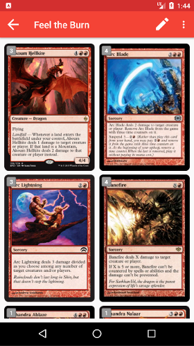
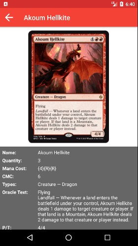
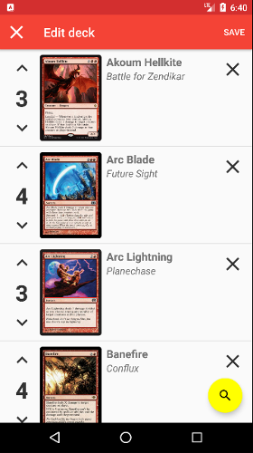
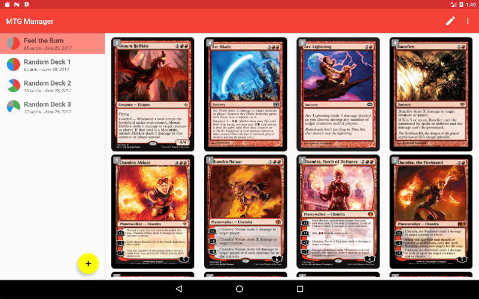
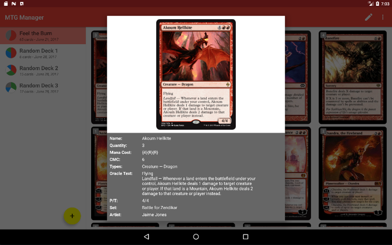
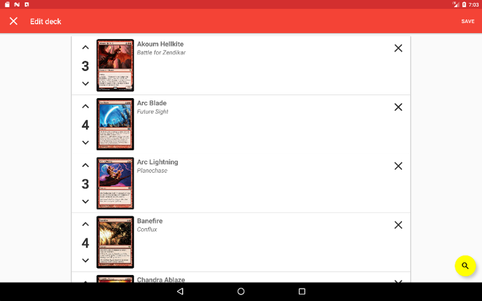

# MTG Manager

MTG Manager is an easy to use [Magic the Gathering]( http://magic.wizards.com/en) deck manager app that allows you to create and manage various MTG decks, add or remove cards and specify the number of copies of a given card in a deck. MTG Manager uses the [MTG API](https://magicthegathering.io/) to get card information, and all card images are retrieved from Wizard of the Coast's [Gatherer](http://gatherer.wizards.com/Pages/Default.aspx) tool. 
All card images are *&copy; Wizards of the Coast*.

# Screenshots

##### Phone






##### Tablet





# Installation Details

In order for the MTG Manager app to build and work properly, it requires a Firebase config file named ```google-services.json``` in the ```app``` module directory. This file is not part of the GitHub repository because it contains private API Keys. To obtain a Firebase config file, follow the steps outlined in the **Manually add Firebase** section of the [Add Firebase to Your Android Project](https://firebase.google.com/docs/android/setup) page.

Additionally, in order for the ```installFreeRelease``` and ```installPaidRelease``` Gradle tasks to work properly, a ```keystore.jks``` file and a ```keystore.properties``` file need to be added to the project root. To create a ```keystore.jks``` file, follow the steps outlined in the **Generate a key and keystore** section of the [Sign Your App](https://developer.android.com/studio/publish/app-signing.html) page. The format of the ```keystore.properties``` file is as follows:

```
storePassword=REPLACE_WITH_KEYSTORE_PASSWORD
keyPassword=REPACE_WITH_KEY_PASSWORD
keyAlias=REPLACE_WITH_KEY_ALIAS
storeFile=REPLACE_WITH_KEYSTORE_FILE_LOCATION
```
